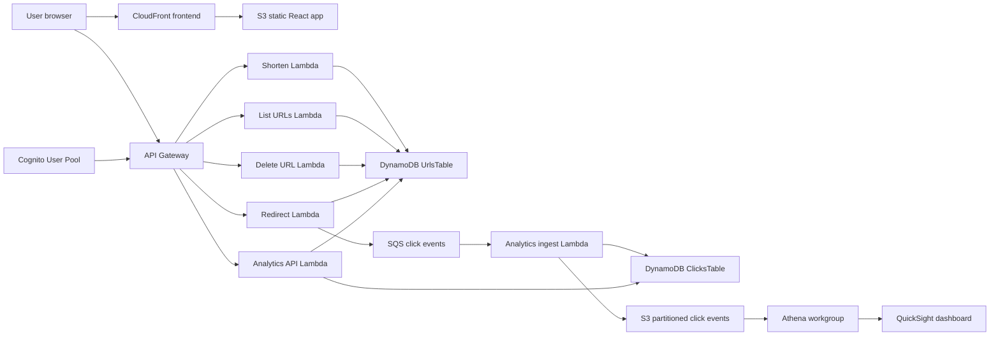

# Architecture

## Data Flow

1. A signed-in user creates a short URL from the React frontend.
2. API Gateway authorizes the request with Cognito and invokes the shortening Lambda.
3. The Lambda stores the short code, long URL, owner id, timestamps, and click counter in DynamoDB.
4. Anyone visiting `/{shortCode}` triggers the public redirect Lambda.
5. The redirect Lambda reads DynamoDB, increments the real click counter, sends a click event to SQS, and returns a 302 redirect.
6. The analytics ingest Lambda consumes SQS events, enriches basic device/browser/source values, writes individual click records to DynamoDB, and writes partitioned JSON events to S3.
7. The analytics API reads the real DynamoDB records and returns the dashboard data.
8. Athena and QuickSight can query the partitioned S3 event dataset for reporting.
